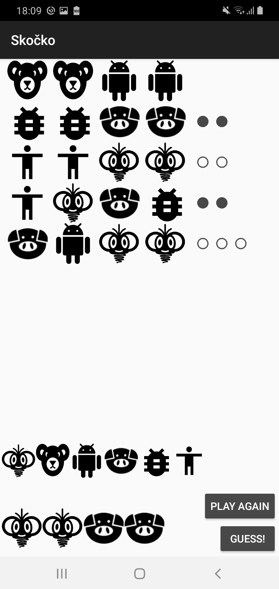
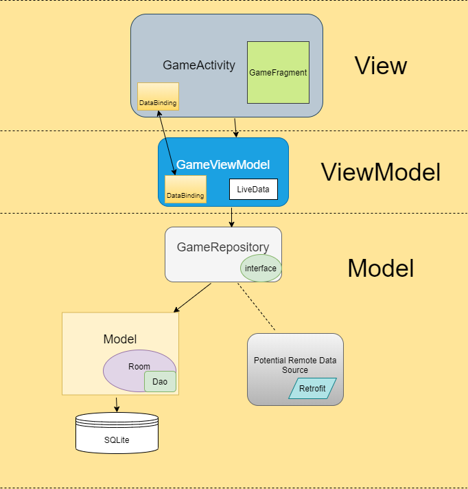
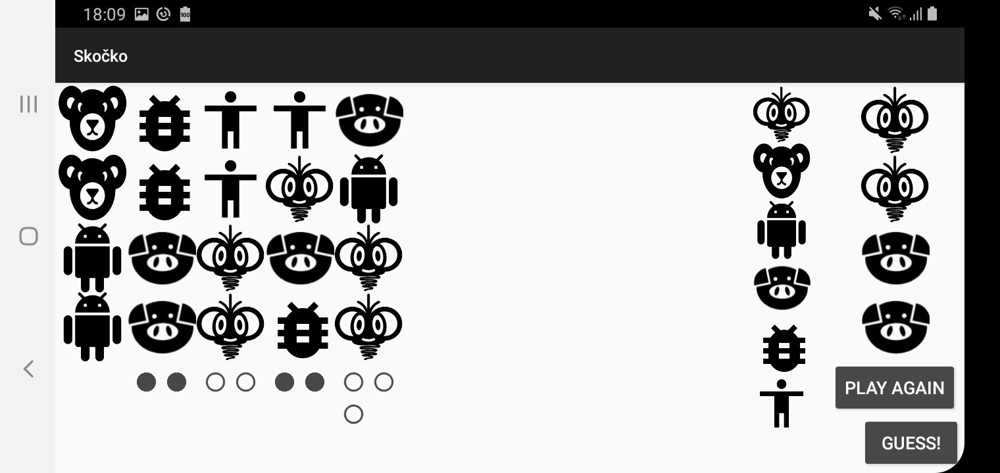

## Skočko
Mastermind game

## Overview
This is an Android mobile app project that:
* showcases Mastermind game
* uses MVVM architecture
* is inspired by a popular Serbian Mastermind variant (Skočko or Jumpy) from the TV Show [Slagalica](https://youtu.be/QTf_eWF2sFQ?t=760)

## Architecture

* **Model** layer is in charge of storing and accessing data
* **RoomDB** + **Dao** + **Entities** were implemented on the top of SQLite
* **GameRepository** is an abstraction in charge of empowering the separation of concerns
* **GameViewModel** is the core of the app which interacts both with the UI and the Data layer
* **GameActivity** is as lightweight as possible
* **GameFragment** is in charge of binding data and xml and passing events to GameViewModel
* **UI** and **Unit test cases** were implemented to prove app behaves properly
* Skočko app adapts well to edge cases like and supports **screen rotation**

## Potential Enhancements
* add statistics
* increase the No of tests
* add more error handling
* add a timer
* implement difficulty levels

## Other
* Kudos to [Mañana](https://www.linkedin.com/in/nemanjaradovanovic) for designing Skočko, Bear and Piggy icons!
* Kotlin and MVVM knowledge base: [Codelabs](https://codelabs.developers.google.com/android-kotlin-fundamentals/)
